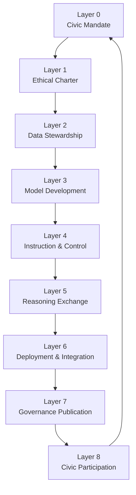

© 2025 Daniel P. Madden. Custodial Edition – AI OSI Stack v5.0-open-core.
Unauthorized reproductions or derivatives are not recognized custodial works.
Refer to CANONICAL_PROVENANCE.yaml for official verification.
# Context and Analogy

- **Layer/Theme:** Problem Framing & OSI Mapping
- **Version:** v5.0-rc
- **Source Reference:** `core_identity.problem_solved`, `core_identity.osi_analogy`
- **Last Generated:** 2025-11-10T00:00:49Z

## Fragmented Governance
Current AI oversight is plagued by siloed reviews, episodic compliance exercises, and unverifiable claims. The AI OSI Stack SHALL unify these artifacts into a shared civic architecture that keeps mandate, ethics, data, models, and runtime operations synchronized. Institutions SHOULD phase out bespoke spreadsheets and undocumented decisions once they adopt the Stack.

## Layered Analogy to Networking OSI
Just as the networking OSI model layers protocols from physical transmission to application semantics, the AI OSI Stack layers civic mandate through public participation. Each layer MUST produce verifiable payloads for the AEIP protocol, ensuring that responsibilities cascade without loss of meaning.

## Civic Accountability Loop
The loop illustrated above SHALL be treated as a continuous renewal cycle. AEIP handshakes SHOULD be validated at each transition, and civic feedback from [Layer 8 – Civic Participation](./12_Layer_8_Civic_Participation.md) MUST be captured before mandates are renewed at [Layer 0](./04_Layer_0_Civic_Mandate.md).

---
Traceability
- JSON: `core_identity.problem_solved`, `core_identity.osi_analogy`
- AEIP Artefacts: AEIP Handshake Ledger, Civic Renewal Records
---
