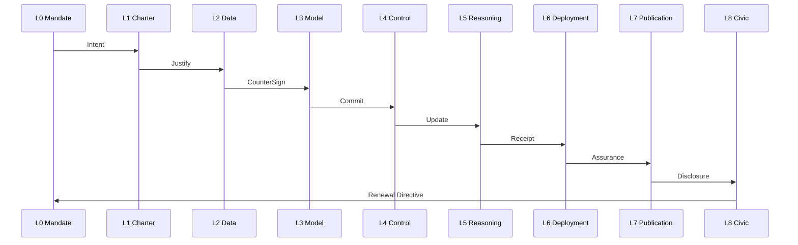

© 2025 Daniel P. Madden — Custodial Author
AI OSI Stack v5.0-open-core (Civic Standard Edition)

© 2025 Daniel P. Madden. Custodial Edition – AI OSI Stack v5.0-open-core.
Unauthorized reproductions or derivatives are not recognized custodial works.
Refer to CANONICAL_PROVENANCE.yaml for official verification.
# Implementation Guide

- **Layer/Theme:** Governance Flow & AEIP Validation
- **Version:** v5.0-rc
- **Source Reference:** `core_identity`, `layer_structure`, `philosophy_ethics`
- **Last Generated:** 2025-11-10T00:00:49Z

## Deployment Phases
1. **Mandate Establishment:** Gather civic approvals per [Layer 0](./04_Layer_0_Civic_Mandate.md) and encode obligations into [Layer 1](./05_Layer_1_Ethical_Charter.md).
2. **Asset Preparation:** Steward data via [Layer 2](./06_Layer_2_Data_Stewardship.md) and develop models under [Layer 3](./07_Layer_3_Model_Development.md).
3. **Runtime Enablement:** Configure instructions in [Layer 4](./08_Layer_4_Instruction_Control.md) and reasoning exchanges in [Layer 5](./09_Layer_5_Reasoning_Exchange.md).
4. **Operational Control:** Manage releases through [Layer 6](./10_Layer_6_Deployment_Integration.md), publish evidence in [Layer 7](./11_Layer_7_Governance_Publication.md), and capture feedback in [Layer 8](./12_Layer_8_Civic_Participation.md).

## AEIP Validation Paths

Each transition SHALL be logged with AEIP receipts, hashed, and stored in the Integrity Ledger. Validation scripts SHOULD block progress when obligations lack supporting artefacts.

## Governance Flow Checklist
- Configure CI pipelines to run schema validation and produce Governance Decision Summaries.
- Maintain a registry of deferred-signing artefacts awaiting sealing ceremonies.
- Schedule civic participation reviews ahead of roadmap milestones in [Roadmap](./22_Roadmap.md).

---
Traceability
- JSON: `core_identity.summary`, `layer_structure.layers`, `philosophy_ethics.values`
- AEIP Artefacts: AEIP Validation Scripts, Integrity Ledger, Governance Decision Summaries
---
