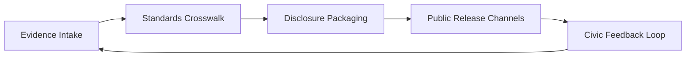

© 2025 Daniel P. Madden — Custodial Author
AI OSI Stack v5.0-open-core (Civic Standard Edition)

© 2025 Daniel P. Madden. Custodial Edition – AI OSI Stack v5.0-open-core.
Unauthorized reproductions or derivatives are not recognized custodial works.
Refer to CANONICAL_PROVENANCE.yaml for official verification.
# Governance Publication Process

- **Layer/Theme:** Evidence to Disclosure Workflow
- **Version:** v5.0-rc
- **Source Reference:** `layer_structure.layers[7]`, `documentation_goals.examples_references`
- **Last Generated:** 2025-11-10T00:00:49Z

## Workflow Overview
1. **Evidence Intake:** Collect sealed manifests from [Layer 6 – Deployment & Integration](./10_Layer_6_Deployment_Integration.md).
2. **Crosswalk Assembly:** Map artefacts against ISO 42001, NIST AI RMF, and EU AI Act requirements per [Documentation Goals](./00_Overview.md#usage-guidance).
3. **Disclosure Packaging:** Compile Governance Decision Summaries, Assurance Manifests, and Integrity Ledger snapshots.
4. **Public Release:** Publish dossiers to civic registries, investor briefings, and regulatory portals.

## Publication Diagram

## Quality Controls
- Disclosures SHALL undergo legal review and civic validation prior to release.
- AEIP verification hashes SHOULD be embedded in each dossier.
- Publication logs MUST record distribution lists for transparency.

## Reference Materials
- AEIP validator notebooks and Control Tower dashboards SHOULD accompany disclosures.
- Sector pilots in finance, healthcare, and public-sector oversight SHALL be highlighted when relevant.

---
Traceability
- JSON: `layer_structure.layers[7]`, `documentation_goals.examples_references`
- AEIP Artefacts: Governance Decision Summaries, Standards Crosswalks, Publication Logs
---
