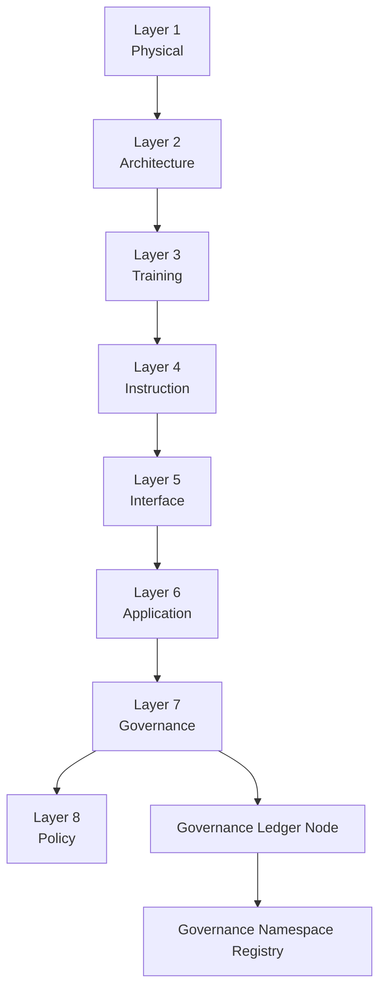
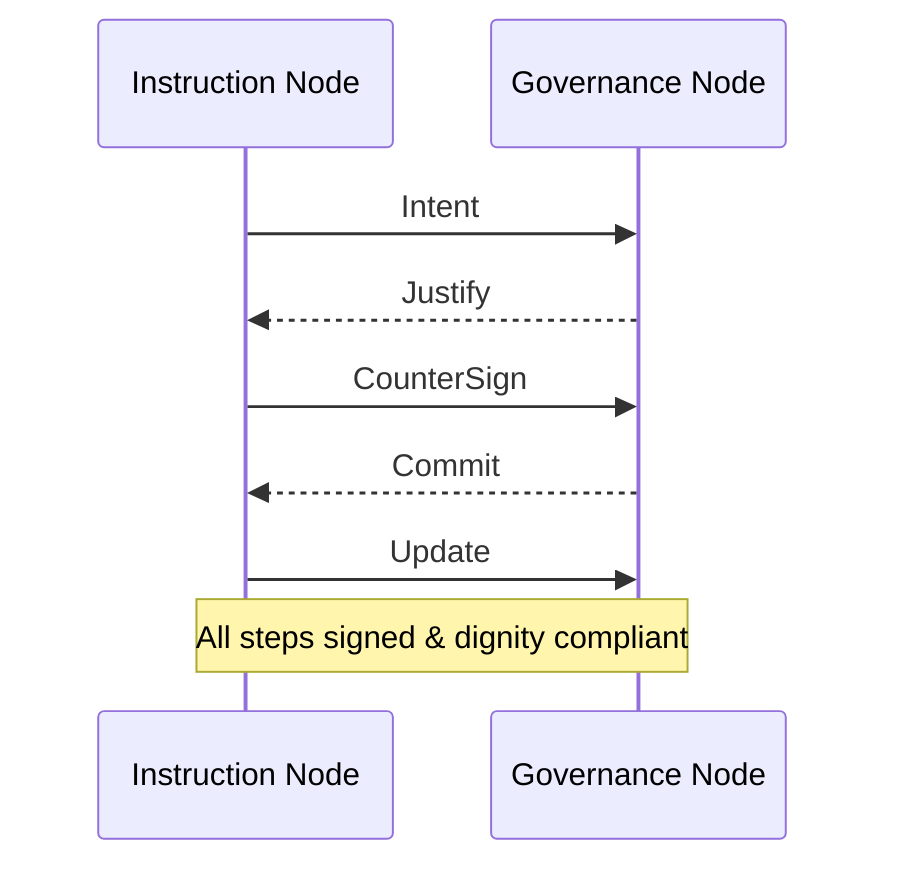

© 2025 Daniel P. Madden — Custodial Author
AI OSI Stack v5.0-open-core (Civic Standard Edition)

© 2025 Daniel P. Madden. Custodial Edition – AI OSI Stack v5.0-open-core.
Unauthorized reproductions or derivatives are not recognized custodial works.
Refer to CANONICAL_PROVENANCE.yaml for official verification.
<!-- SPDX-License-Identifier: CC-BY-SA-4.0 -->

# AI OSI Protocol Reference (AI_OSI-00)

**Status:** Draft for Implementation Guidance  
**Editors:** AI Governance Reference Implementation Team  
**Related Normative Sources:** ISO/IEC 42001, NIST AI RMF, EU AI Act Recital 60, AI_OSI_Stack_v4_Test_Integrated.md

---

## 1. Introduction

The AI OSI protocol reference maps the conceptual AI OSI Stack v4 (Test Integrated) to a modular, testable implementation analogous to the TCP/IP family atop the OSI networking model.  Each layer exposes interoperable contracts, traceable dignity safeguards, and AEIP transport compatibility.  This document is the living RFC-style specification that SHALL evolve via governance ledger entries.

## 2. Layer Overview

| Layer | Name | Key Responsibilities | Mandatory Artifacts |
| --- | --- | --- | --- |
| L1 | Physical | Telemetry normalization, energy stewardship, persona safety interlocks | Physical Envelope |
| L2 | Architecture | Persona topology, interface negotiation, capacity planning | Architecture Envelope |
| L3 | Training | Corpus governance, alignment specification | Training Spec |
| L4 | Instruction | Instruction packetization, AEIP handshake preparation | ITP, DRR |
| L5 | Interface | Header canonicalization, persona signature propagation | AEIP Headers |
| L6 | Application | Reasoning outputs, service responses | GDS, OAM |
| L7 | Governance | Oversight synthesis, ledger integration | ILE |
| L8 | Policy (opt) | Civic participation overlays, human rights clauses | Civic Directive |

All layers MUST expose a `dignity_compliance` flag and SHALL refuse unsafe operations.  Provenance fields (`source`, `timestamp`, `personaId`, `hash`) are REQUIRED on every exchanged artifact.

## 3. Architectural Diagram

## 4. Conformance Classes

* **Class A – Conceptual compliance:** Component prototypes implement IDDs and dignity safeguards with offline validation.
* **Class B – AEIP-Lite node:** Implements AEIP v1 handshake and submits artifacts to a local governance ledger.
* **Class C – Federated ledger integration:** Synchronizes AEIP transcripts with distributed ledgers and publishes to `registry_gns.yaml`.

## 5. AEIP Integration

The AEIP transport spine SHALL implement the five-step handshake (`Intent → Justify → CounterSign → Commit → Update`).  Headers MUST include `aeipVersion`, `temporalSeal`, `personaSignature`, and `governanceScope`.  Successful handshakes SHALL emit an Integrated Ledger Entry (ILE) conforming to `schemas/ile_schema.json`.

## 6. Governance Clauses

Temporal governance SHALL be enforced by `temporalSeal` issuance per step.  Drift detection is achieved by comparing handshake timestamps with ledger arrival time.  Dignity constraints derive from the Persona Architecture normative language and SHALL trigger refusal pathways whenever `dignity_compliance=False`.

## 7. Change Management

Updates to this specification MUST be captured as GDS and DRR artifacts, anchored to the ledger using AEIP handshakes, and versioned in `/docs/AI_OSI_Protocol_Spec.md`.  Derived implementations SHALL reference the ledger entry ID for traceability.

---

*This living document is published under CC BY-SA 4.0 and inherits the Normative Language Notice from meta/INTEGRITY_NOTICE.md.*
